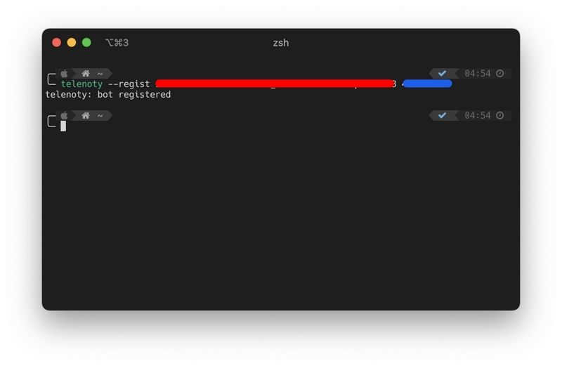
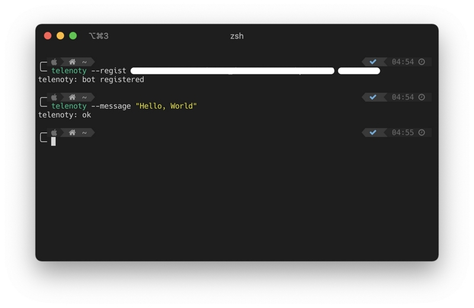
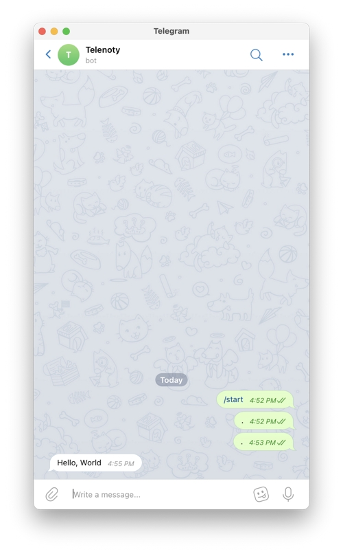
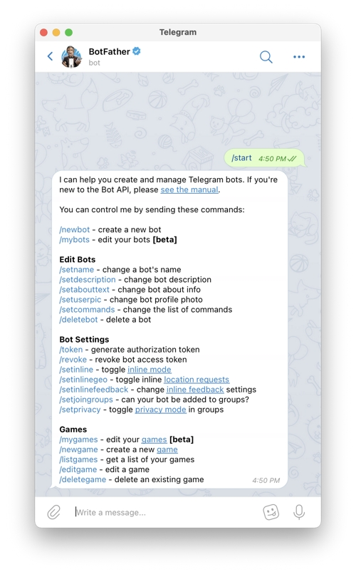
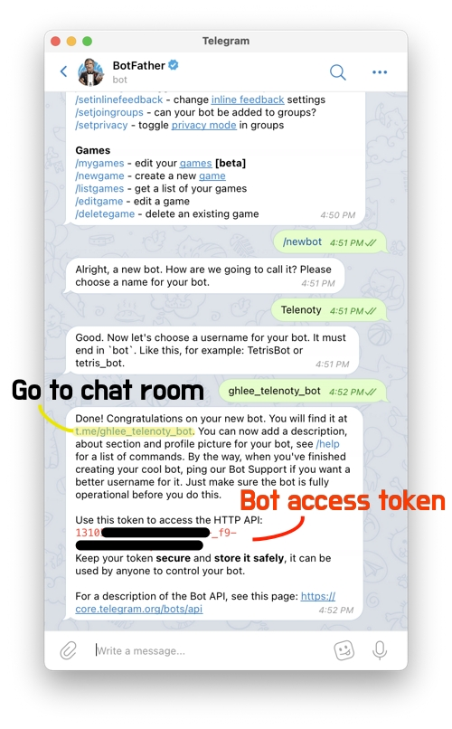
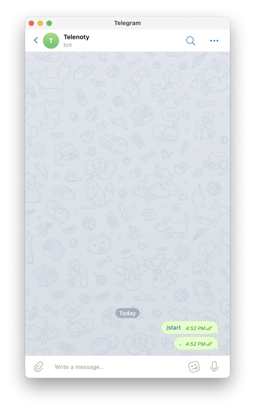
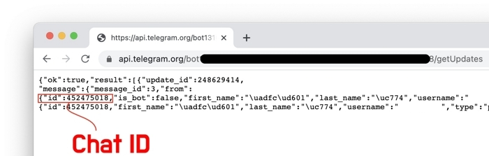

# telenoty

📢 Simple and Easy to emit notification via Telegram

[](https://www.npmjs.com/package/telenoty)


## Installation

```bash
npm install -g telenoty
```

## Usage

- Required - [Telegram Bot](#craete-bot)
  - Create your Telegram bot
  - Get access token
  - Get chat id
  - Regist and enjoy!

```bash
# Regist bot information (save on ~/.telenoty)
# --regist, -r
telenoty --regist {BOT_TOKEN} {CHAT_ID}

# Send message
# --message, -m
telenoty --message {MESSAGE}
```





- More usage
  - with [Python](#with-python)

## Create bot

1. Create Telegram bot

   - [@BotFather](https://telegram.me/botfather)

    

2. Get access token

   - Send bot name and ID
   - Copy access token (for registration)
   - Go to chat room

    

3. Get chat id

   - Send any message

    

   - and go to [https://api.telegram.org/bot{ACCESS_TOKEN}/getUpdates](https://api.telegram.org/botYOUR_TOKEN/getUpdates)

    

   - Copy chat id

4. Regist and enjoy!
   - [Go](#usage)

## with Python

```python
import subprocess

def send_message(message):
    return subprocess.call(['telenoty', '--message', message], \
        stderr=subprocess.DEVNULL, stdout=subprocess.DEVNULL)

result = send_message('test')
if result == 0:
  print('success')
else:
  print('fail')
```

## Devlopment

```bash
# Install dependencies
npm i

# Build for production
npm run build

# Test
node dist/telenoty.js
```

## License

[MIT](LICENSE)
